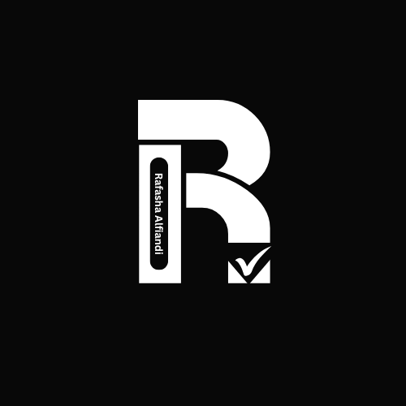

# 👋 Halo! Saya Rafasha Alfiandi 🚀

  

## 👨‍💻 Tentang Saya

Saya seorang **Programmer** & **Content Creator** yang suka ngulik teknologi, bikin project seru, dan berbagi pengetahuan lewat konten edukatif & tutorial.

- 🎥 Aktif bikin konten di [YouTube](https://youtube.com/@Rafashaalfiandi)
- 💻 Fokus di **web dev**, **tools hacking**, dan **pengembangan software**
- 🚀 Terus belajar hal baru & eksplor teknologi masa depan

---

## 🛠️ Tools & Teknologi

  

## 💻 Bahasa Pemrograman

  

---

## 📊 Statistik GitHub

  
  
  
  
  

---

## 🎬 Video Terbaru YouTube
✅ [Membuat Website Animasi Kubus/kotak dengan HTML (Tutorial)](https://youtu.be/NJMbFQfho8o) 
✅ [Build Kalkulator Responsif - HTML, CSS, JS](https://youtu.be/NJMbFQfho8o)

---

## 📣 Kontak Saya

  
  

---

## 🌐 Sosial Media

  
  
  

---

## 🚀 *"Ngoding dengan semangat, berkarya dengan tujuan!"*
